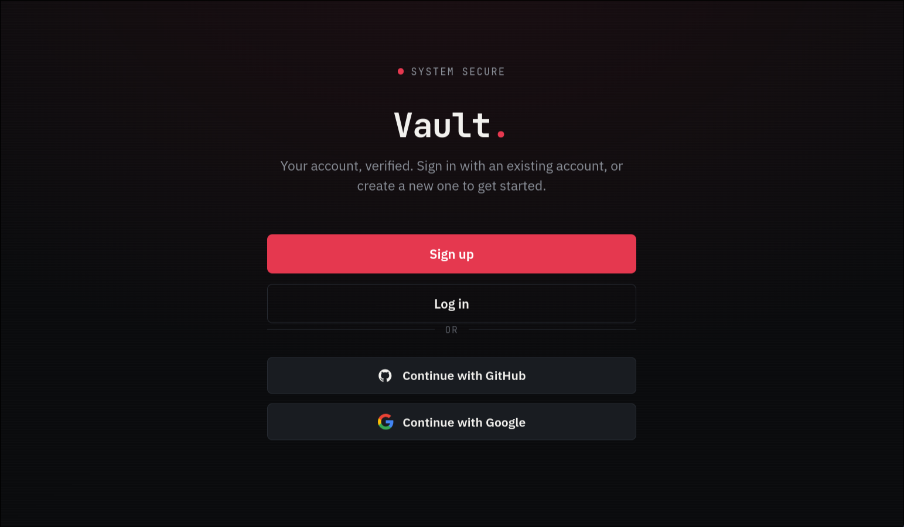

<p align="center">
  
  
  
</p>

<h1 align="center">🔐 Secure Login Demo</h1>

<p align="center">
  A production-minded authentication system built with NestJS, React, JWT, OAuth 2.0, and OpenID Connect.
</p>

An authentication system demonstrating how to build **secure, observable, and maintainable** auth with NestJS + React. Every security decision is intentional and traceable.

---

##  In Action

<p align="center">
  
</p>

The interface supports password authentication as well as GitHub and Google sign-in. New local accounts must verify their email before they can log in.


---

## Why This Exists

Most auth tutorials stop at "hash the password and sign a JWT." This repo goes further  it implements the **defense in depth** patterns you actually need before shipping to production:

- **Refresh token rotation** with bcrypt-hashed secrets (stolen DB ≠ stolen sessions)
- **Account lockout** with sliding-window brute-force protection
- **Manual OAuth flows** (no Passport black boxes) PKCE, state validation, explicit email verification
- **Full audit trail** — every auth event logged with IP + user agent
- **Email verification** with one-time burn-after-reading tokens
- **Rate limiting, helmet  CSP headers, httpOnly cookies, correlation IDs** the boring stuff that saves you at 3 AM

---

## Stack

| Layer | Tech |
|------|------|
| Backend | NestJS · TypeScript · Prisma · PostgreSQL · Redis |
| Auth | JWT (15m access) · bcrypt (cost 12) · OAuth 2.0 + OIDC · PKCE |
| Frontend | React · Vite · TypeScript |
| Infra | Docker · Nginx · GitHub Actions · Docker Scout |

---

## Architecture

```
┌─────────┐     ┌────────┐     ┌─────────────┐
│ Browser │────▶│ Nginx  │────▶│ NestJS API  │
│ (React) │◀────│ 80/443 │◀────│   :3000     │
└─────────┘     └────────┘     └──────┬──────┘
                                      │
                    ┌─────────────────┼─────────────────┐
                    ▼                 ▼                 ▼
               PostgreSQL         Redis (tokens)      Gmail SMTP
```

---

## Quick Start

```bash
# 1. Clone & env
git clone https://github.com/askri-7/secure-login-demo.git
cd secure-login-demo
cp backend/.env.example backend/.env   # fill in your secrets

# 2. Run everything
docker compose up --build

# 3. Open http://localhost:5173
```

## Email Verification Flow

Local signup uses an explicit email-verification link before authentication is allowed:

1. The user submits the signup form with a name, email, and password.
2. The backend creates the account with `emailVerified: false` and generates a random one-time token.
3. The token is stored in Redis for 24 hours as a bcrypt hash. The raw token is sent only in the verification email.
4. The email link calls `GET /auth/verify-email?token=...` on the backend.
5. The backend validates the token, deletes it so it cannot be reused, marks the email as verified, and redirects to the frontend login page.
6. Missing, invalid, expired, or already-used links redirect to the verification error page with a clear retry path.

Configure `FRONTEND_URL` and the `SMTP_*` variables in `backend/.env` before testing the real email flow. When SMTP is not configured, the backend logs the verification URL to the console as a local development fallback.


---

## Security Highlights

| Feature | How It's Done |
|:--------|:--------------|
| **Passwords** | bcrypt, cost factor 12 |
| **Sessions** | httpOnly `SameSite=Lax` cookies — no localStorage |
| **Refresh tokens** | Split-token pattern: `tokenId` (indexed lookup) + bcrypt-hashed secret. Rotated on every use. Revoked tokens cleaned daily at 3 AM. |
| **OAuth** | Manual `fetch`-based flows (GitHub) + `openid-client` (Google). PKCE + cookie-stored `state` to prevent CSRF. |
| **Account linking** | One local user can link GitHub and Google identities. |
| **Brute force** | 3 failed logins → 15-min lockout. Timing-attack safe (dummy bcrypt on missing users). |
| **Rate limiting** | `@nestjs/throttler` — 10 req/min per endpoint. |
| **Audit** | Every signup, login, logout, refresh, OAuth attempt logged with IP + user agent. |
| **Headers** | Helmet CSP, CORS whitelist, correlation IDs for tracing. |

---

## Project Structure

```
backend/
  src/auth/          # JWT, OAuth, guards, DTOs, audit logging
  src/email/         # SMTP + email verification token service
  src/users/         # RBAC-protected user routes
  prisma/            # Schema + migrations

frontend/
  src/pages/         # Login, Signup, VerifyEmail, Profile
  src/lib/api.ts     # Auto-refreshing fetch wrapper
```

---

## CI/CD

```
Push to main
    │
    ▼
┌─────────────┐    ┌─────────────┐    ┌─────────────┐
│ Lint + Build │───▶│ Docker Scout│───▶│ Deploy to VM│
│  + Secret Scan│    │  CVE scan   │    │  via SSH    │
└─────────────┘    └─────────────┘    └─────────────┘
```

---

## License

MIT
